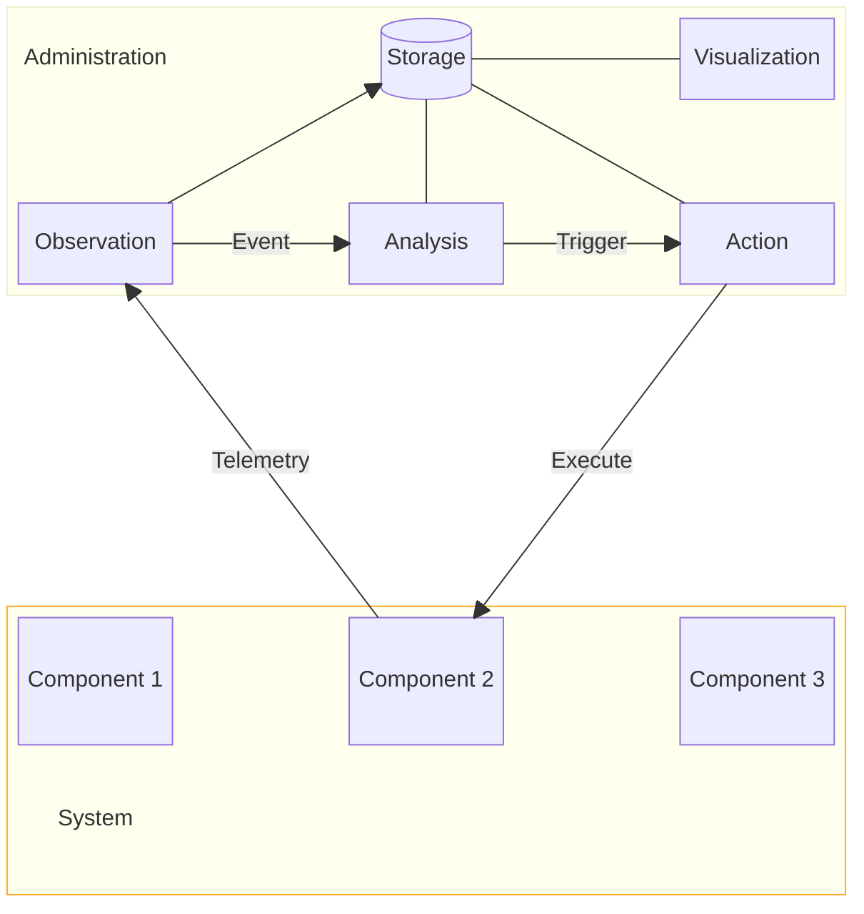
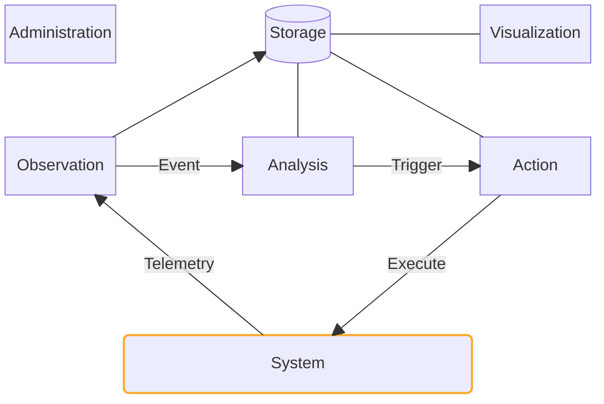

---

---

## layout: two-cols-header

<PresenterTimer :minutes="5" :seconds="0" />

# 6 Core Functions of a Monitoring System

 

::left::

- **Observation**: Collect, detect
- **Analysis**: Correlate, calculate, filter
- **Action**: Notify, respond
- **Storage**: Retain, serve
- **Visualization**: Dashboard, report, browse
- **Administration**: Configure, maintain, secure

::right::

 

\* [Inspired by](https://www.researchgate.net/figure/A-monitoring-system-has-four-main-components-observation-analysis-action-and-storage_fig1_279184218)

<!--
A monitoring system has 6 main components: observation, analysis, action, storage, visualization, and administration. An observation point represents technical means to recognize a system's state and state changes. The observation component acquires data and generates events. The analysis component processes events and triggers the action component if necessary. The action component can then enforce actions or report events. The storage component stores events and data. The visualization component provides a user interface to monitor the system. The administration component configures and maintains the monitoring system and overlaps with all functions
-->

---

---

<PresenterTimer :minutes="2" :seconds="0" />

# Telemetry | Monitoring | Observability

Terms and disambiguation

<v-clicks>

- **Telemetry** (_noun_):
  - The data we collect from our systems
- **Monitor** (_verb_):
  - The act of processing realtime telemetry for some business purpose.
- **Observability** (_noun_):
  - The ability to understand the state & health of a system based on its telemetry.

</v-clicks>

<!--
Telemetry:
- Logs, metrics, and traces are all forms of telemetry data.
- It is the supporting pillar of observability and monitoring.
- The "WHAT"

Monitoring:
- Processing telemetry data to detect anomalies or predefined conditions.
- It's the "doing" part. The "HOW".

Observability:
- A quality of your system that describes how well you understand its state from the outside. (ie "How well can we observe this?")
- The more complete the telemetry is, the more effective the monitoring is, the more "observable" the system is.
- Observability is the goal, telemetry and monitoring are the means.
- More a mindset than a toolset, empowering teams to answer any question through the collection and analysis of data
- The "WHY"
-->

---

## layout: two-cols-header

<PresenterTimer :minutes="4" :seconds="0" />

# Monitoring AV is hard

Way harder than it has any right to be

 

::left::

<v-clicks>

- Agentless / Hardware-based
- No API/communication standards
- Proprietary
- System complexity & health modeling

</v-clicks>

::right::

<v-clicks>

- Limited community
- Documentation
- Limited commerical pressure
- Competing interests

</v-clicks>

<v-click>

 

...and it's [not getting easier]{.highlight} anytime soon.

</v-click>

<!--
- [click] Agentless. This is a big one. Most AV systems are agentless, which means that you can't just install an agent on a device and start monitoring it. You have to rely on the device's own monitoring capabilities & APIs, which are often limited. When we talked about observability earlier, this is why. If the devices aren't observable, you're going to have a hard time making the system observable.
- [click] No API/communication standards. This is a big one. The only APIs that exist tend to be control APIs rather than management APIs. This makes it difficult to get data out of systems. But thankfully all manufacturers provide really great APIs for us to use!!
- [click] Just kidding...Proprietary systems are a closed book. They often don't want to reveal APIs, adopt standards, share documentation, or allow any kind of extensability.
- [click] System complexity. AV systems are complex, with many moving parts, and many different types of data that need to be monitored. Moreover the health of the system is not necessarily the health of it's devices...there's nuance in the way devices relate, which can make calculating system health complex.
- [click] Limited community. There are few people in the AV industry who are focused on monitoring, and even fewer who are focused on monitoring AV systems. This means that there are few resources available to help you get started.
- [click] Limited documentation. Many manufacturers don't provide good documentation on their APIs, and in many cases there's no documentation at all. This makes it difficult to get started.
- [click] Limited commercial pressure. There is no commercial pressure on manufacturers to provide monitoring APIs. Nobody is refusing to buy gear because it isn't monitorable. This means that manufacturers have no incentive to provide monitoring APIs.
- [click] Competing interests. Making monitoring easier for you is directly competitive with their own proprietary configuration management platforms. They don't want to make it easier for you to monitor your systems, because they want you to use their tools.
- [click] And it's not getting easier anytime soon. The AV industry is slow to change, and it's going to take a lot of effort to get it to a place where monitoring is easy and accessible.
-->

---

<PresenterTimer :minutes="2" :seconds="0" />

# Centralized, Continuous, and Real-Time Analysis and Aggregation

Defining monitoring cont.

<v-clicks>

- Centralized
- Continuous
- Real-time
- Analysis
- Aggregation

</v-clicks>

<!--
- [click] centralized means that all of your monitoring data is in one place. You can't monitor your systems effectively if you have to go to multiple places to get the data you need. You need a single pane of glass that gives you a complete view of your systems. This is especially true if health monitoring is on the table, which I'll talk about in a moment. But critically, you cannot monitor your systems effectively if you have to go to multiple places to get the data you need. You need a single pane of glass that gives you a complete view of your systems.

THOUGHT EXPERIMENT: You wake up in the morning, your paint's peeling, your curtains are gone, and the water is boiling. Which problem do you deal with first? 
None of them! The building's on fire!

But you don't know that unless you can see all of those things together, in context

- [click] Continuous means that your monitoring is always on and always collecting data. This can't be manual, etc.
- [click] Real-time means that the data we are collecting is up-to-date and accurate. We can't monitor our systems effectively if we're working with stale data. We need to be able to see what's happening in our systems right now, not what was happening an hour ago. Fresh and accurate data is critical. 
- [click] Analysis and processing means that we're not just collecting data. Our software needs to allow for detailed analysis of the data, surfacing patterns, anomalies, and trends in the data. We're correlating data from multiple sources to get a complete picture of our systems. We're filtering out the noise and focusing on the signal. We're turning data into information, and information into action. 
- [click] Aggregation means that we're collecting data from multiple sources and storing it all in one place. We're not just monitoring one system, we're monitoring all of our systems. We're not just monitoring one device, we're monitoring all of our devices. We're not just monitoring one service, we're monitoring all of our services. We're collecting data from all of our systems, and aggregating it into a single view.
-->

---

<PresenterTimer :minutes="2" :seconds="0" />

# All Relevant Data from All Devices, Systems, and Services

Defining monitoring cont.

<v-clicks>

- All relevant data
- All devices, systems, and services

</v-clicks>

<!--
- [click] All relevant data means that we're not just collecting data for the sake of collecting data. 
- We're collecting data that: 
  - is relevant to our systems and our business goals. 
  - helps us understand the health and performance of our systems. 
  - helps us detect and resolve issues.
  - helps us achieve our business goals.
  - helps us delight our customers and grow our business.
- [click] All devices, systems, and services means that we're not just monitoring some devices, or most devices, but all of our devices.
- All of our systems
- All of our services
- If there is a device, system, or service that is part of delivering our on the business promise we're delivering, then we need to be monitoring it.
-->

---

<PresenterTimer :minutes="2" :seconds="0" />

# Determine and Guarantee Health

Defining monitoring cont.

<v-clicks>

- Determine health
- Guarantee health

</v-clicks>

<!--
- [click] Determine and guarantee health means that we're responsible for understanding the state of our systems, and ensuring that they are healthy. 
- System health is an extremely complicated topic. It's not just about whether a device is up or down, or whether a service is running or not. It's about understanding the state of the system as a whole, and ensuring that it is operating as expected. A display can have nothing wrong with it, be throwing no errors, and yet still make a system unusable. Just put it on the wrong input. 
- This is especially critical if we're going to be offering managed services and offering an uptime SLA to our customers. We need to be able to guarantee that our systems are healthy, and that they are performing as expected, and that is a very difficult thing to do.
- [click] Guaranteeing health means that we're not just monitoring our systems, we're actively working to ensure that they are healthy. We're not just collecting data, we're taking action based on that data. We're not just detecting issues, we're resolving them. We're not just monitoring our systems, we're actively working to ensure that they are healthy. When we're offering an SLA, it's a promise that we're making to our customers, and we need to be able to deliver on that promise.
-->

---

<PresenterTimer :minutes="2" :seconds="0" />

# Detection, resolution, and automation of issues

Defining monitoring cont.

<v-clicks>

- Detection
- Resolution
- Automation

</v-clicks>

<!--
- [click] detection means that we have to go beyond simply collecting the data, and actually be able to detect when something is wrong. This is where the analysis and processing comes in. We're not just collecting data, we're analyzing it, and we're looking for patterns, anomalies, and trends in the data, and we're building triggers that alert us when something is wrong so that we can take action.
- [click] resolution is all about taking action. Typically that means a human being is responding to an alert, digging in, and working to understand what happened. Sometimes this is proactive, and sometimes this is reactive. But the point is we're taking action based on the data, and using it to resolve issues, and keep customers happy. 
- [click] automation is about taking the resolution process and making it faster, more efficient, and more reliable. We're building tools and scripts that make it faster for us to resolve issues. We're automating triggers and alerts so we can respond more quickly, then making scripts to respond for us. We're preventing issues from happening by performing automated routine maintenance. We're building a system that can run itself, so that we can focus our efforts on providing our customers with the best possible service.
-->

---

<PresenterTimer :minutes="2" :seconds="0" />

# Surface meaningful data and insights

Defining monitoring cont.

<v-clicks>

- Meaningful data and insights

</v-clicks>

<!--
- [click] Meaningful data and insights means that there's more to monitoring than fixing systems.
We're collecting data that helps us understand our systems, and helps us make better decisions. 
We're not just collecting data, 
  - we're turning that data into information, and that information into action.
  - we're using that data to improve our systems, and to provide better service to our customers. 
  - we're using that data to drive our business forward.
-->

---

<PresenterTimer :minutes="2" :seconds="0" />

# Our business goals

Defining monitoring cont.

<v-clicks>

- Our business goals
- Our Customer's business goals

</v-clicks>

<!--
- [click] In service of our business goals means that monitoring isn't just about monitoring. It's about taking the business to the next level. 
- Set clear goals that can be met, and ensure that whatever monitoring we do is meeting those goals.
- Because tech that isn't meeting the goals of the business is just a waste of time and money.
- [click] The same goes for our customer's business goals. Any service offer developed and monitoring implemented will only be successful if it meets the goals of the customer.
- So make sure that you understand what their goals are and how monitoring plays into that.
-->

---

<PresenterTimer :minutes="0" :seconds="30" />

# Review: Defining Monitoring

Fred's version

## Monitoring is:

- The centralized, continous, real-time analysis and aggregation...
- ...of all relevant data from all of your devices, systems, and services...
- ...in order to determine and guarantee their health...
- ...empower the detection, resolution, and automation of issues...
- ...and surface meaningful data and insights...
- ...in service of both ours and our customer's business goals.

<!--
- So that's what monitoring is to me
- Let's talk about why we should monitor
-->

---

<PresenterTimer :minutes="1" :seconds="0" />

# What monitoring is [not]{.highlight}?

What things sometimes get conflated with monitoring

## Monitoring is not:

<v-clicks>

- Jumping between 3 different vendor-specific tools
- Remote access tools (sometimes bundled, not always)
- Control systems
- Customer portals
- Ticketing systems
- ...etc.

</v-clicks>

<!--
- Don't be fooled by the marketing hype.
- If it isn't giving you a centralized view of your systems, it isn't monitoring.
-->

---
layout: center
---

<PresenterTimer :minutes="3" :seconds="0" />

# Why should we monitor?

What benefits does it bring?

<!--
- **INTERACTIVE**
-->

---

<PresenterTimer :minutes="1" :seconds="0" />

# Health over Time
Monitoring platforms

<!--TODO: Slide-->

<v-clicks>

- How do you know if your systems are healthy?
- What is health? System health? Device health? Service health?
- How do we measure health? How do we track it over time?
- What capabilities do we need in order to measure health?

</v-clicks>

<!-- <v-clicks>

- The [centralized]{v-mark.box.orange="6"}, continous, real-time collection, analysis and aggregation...
- ...of all relevant data from all relevant devices, systems, and services...
- ...in order to determine and measure their health over time...
- ...empower the detection and resolution of issues...
- ...and surface meaningful data and insights...
- ...in service of some business objective.

</v-clicks> -->

---
layout: statement
---

<PresenterTimer :minutes="0" :seconds="20" />

## We know [what]{.highlight} monitoring is, [why]{.highlight} we should do it, and [what to look]{.highlight} for in a monitoring platform.

 

<v-click>

## So let's [get started]{.highlight}!

</v-click>

---
src: ./pages/getting-started.md
---