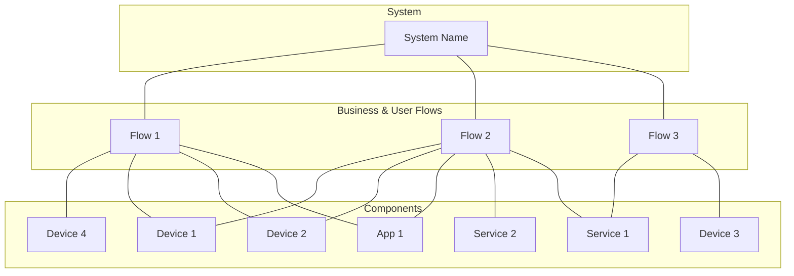
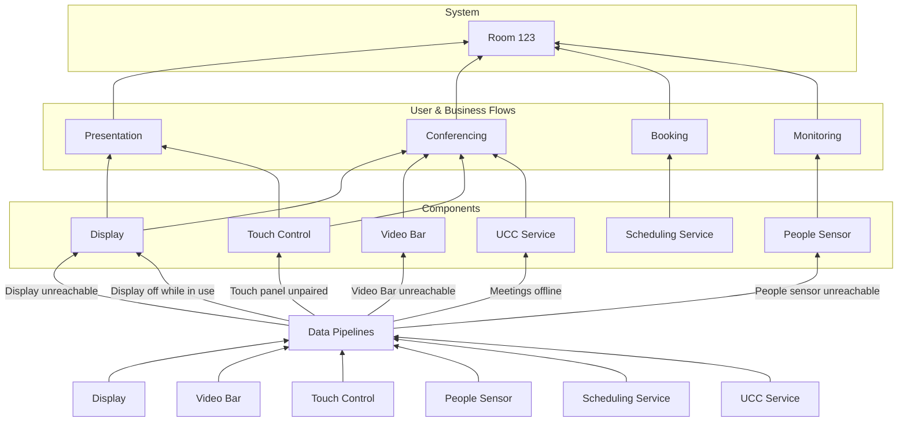

<PresenterTimer :minutes="0" :seconds="30" />

# Health Models

Determining the health of complex systems

---
layout: default
---

<PresenterTimer :minutes="1" :seconds="0" />

# Getting started

What's next after KPIs?

<v-clicks>

- We have [Goals]{.highlight}, and we have the [KPIs]{.highlight} to measure our progress
- One of our KPIs is ["Uptime"]{.highlight} (aka availability, health, etc.)
- In order to [measure uptime]{.highlight}, we need to:
  - define what ["healthy"]{.highlight} means
  - determine how to [measure]{.highlight} it

</v-clicks>

---
layout: flex-header
---

<PresenterTimer :minutes="2" :seconds="0" />

# Health Model: Big Question

Discuss

::body::

## What does it mean for a system to be "healthy"?

<!--
- Encourage discussion, go over if we can
- Short answer, it depends.
- A few conclusions:
    - Not the health of its resources alone (a device can be sick, while the system is healthy)
    - What's more important is defining "unhealthy", as healthy is just the absence of Problems
-->

---
layout: default
---

<PresenterTimer :minutes="1" :seconds="0" />

# Health Model: Review

Specific to uptime-related KPIs

<v-clicks>

- The formula that determines the [health of a system]{.highlight} from telemetry
- The [methodology]{.highlight} used to feed the KPI for system [uptime]{.highlight} / availability / health
- Represented with traffic lights for [severity]{.highlight} (red, yellow, green)
- Built on top of data-driven [problem events]{.highlight} which are triggered from conditions in the underlying data
- [Unique]{.highlight} to each system template
- [Flexible]{.highlight} model that can be adapted to your needs

</v-clicks>

<!--
- Health modeling is a way to define what "healthy" and "unhealthy" look like for your system.
- Health could change from system TYPE to system TYPE...take a display locked to an input for example.
- KEY: There could be other states, but they must map to either healthy or not as the point of a health model is to determine UP or DOWN which impacts SLAs.
- Determine health states
- Determine factors that contribute to health
- Matrix of health states and factors
- Sometimes used interchangeably with the uptime KPI / SLI itself
Healthy (Ok), Degraded, Unhealthy (Down)
-->

---

<PresenterTimer :minutes="2" :seconds="0" />

# Health Model: Explainer Video

Quick explainer by Microsoft

    <Youtube class="w-5/6 h-500px" id="9C4RUuqZG8w" />

---

<PresenterTimer :minutes="2" :seconds="0" />

# Health Model: Layers

Primary pieces according to Microsoft

<figure class="w-5/6 text-right">
    
    <figcaption>
        <a href="https://learn.microsoft.com/en-us/azure/well-architected/cross-cutting-guides/health-modeling">Image by Microsoft</a>
    </figcaption>
</figure>

<!--
- This applies really cleanly for large cloud applications...but what about AV systems? 
- I think it does, though small AV systems may require a simplified approach. 
- They
-->

---

<PresenterTimer :minutes="2" :seconds="0" />

# Health Model: Key Concepts

What should we take away from Microsoft's model?

<v-clicks>

- Health models are [layered]{.highlight} structures that define the health of a system from the [business]{.highlight} or user [perspective]{.highlight}.
- They are defined from the [top down]{.highlight}, while the [health of the system]{.highlight} is determined from the [bottom up]{.highlight} through a series of [truth tables]{.highlight}.
- The [top half]{.highlight} is user & business focused, with [layer 1]{.highlight} being the [overall system status]{.highlight}, and [layer 2]{.highlight} being the [user & business flows]{.highlight}.
- The [bottom half]{.highlight} is tech focused, with [layer 3]{.highlight} being the [components]{.highlight} that make up the system, and [layer 4]{.highlight} [optionally]{.highlight} being used for extended [sub-components]{.highlight}.

</v-clicks>

<!--
- While Microsoft shows two layers here, I've found that a single "Components" layer is sufficient for simple systems.
- Components are the building blocks of the system (ie devices and services)...any sub-devices simply feed into the health of the parent device.
- Let's look at some examples!
-->

---

<PresenterTimer :minutes="3" :seconds="0" />

# Health Model: Example 1

A simplified example for AV systems

<!--
- Show what a failure might look like
- Show what degraded might look like
-->

---

<PresentaterTimer :minutes="2" :seconds="0" />

# Health Model: How-To

Steps for building a health model

<v-clicks>

1. Start with the [top level]{.highlight} [system health]{.highlight} and define the potential system states beyond just "healthy" and "unhealthy"
   - If there are additional states, what are they, and would they impact our [service level indicator / KPI]{.highlight}?
2. Then, define each discreet user & business [use case]{.highlight} that warrants its own [flow]{.highlight}.
   - Define any additional health states, focusing on the [user's perspective]{.highlight}, and determine how each [impacts overall system health]{.highlight}.
3. Then, consider what [components]{.highlight} are involved in [delivering each flow]{.highlight}
   - Components could be [devices]{.highlight}, services, applications, or even more complex [sub-systems]{.highlight}
   - How would various metrics & conditions in any component [impact]{.highlight} a flow's health state?
4. [If required]{.highlight}, add additional layers for sub-components
   - [Keep it simple]{.highlight}...don't go too deep unless you need to

</v-clicks>

<!--
- Walk them through from top to bottom
-->

---

<PresenterTimer :minutes="5" :seconds="0" />

# Health Model: System Health States

Beyond just "healthy" and "unhealthy"

> 1. Start with the [top level]{.highlight} [system health]{.highlight} and define the potential system states beyond just "healthy" and "unhealthy"
>    - If there are additional states, what are they, and would they impact our [service level indicator / KPI]{.highlight}?

 
<v-clicks>

- [Healthy]{.highlight} until proven otherwise
- [Unhealthy]{.highlight} when a [critical]{.highlight} flow is unhealthy
- [Degraded]{.highlight} when a [non-critical]{.highlight} flow is unhealthy
  - A [Warning]{.color-yellow} state, non-SLI impacting
- [Blocked]{.highlight} when the system is [unavailable for use]{.highlight} for some reason
  - An [Informational]{.color-blue} state, non-SLI impacting

</v-clicks>

<!--
- Don't reveal degraded, try to get someone else to say it
- Same with offline...encourage discussion. 
- The key is to determine what states are important to your system
-->

---

<PresenterTimer :minutes="1" :seconds="0" />

# Health Model: System Health Sates Artifact

Locking in our system health states

| **System State**           | **Description**                            | **Problem Severity**                                                 | **SLI Impact** |
| -------------------------- | ------------------------------------------ | -------------------------------------------------------------------- | -------------- |
| [Healthy/Ok]{.color-green} | [System is operating as expected, default] | [NA]                                                                 | [NA]           |
| [Unhealthy]{.color-red}    | [Critical system flow is down]             | [Crit]{.color-red-800}, [High]{.color-red}, [Average]{.color-orange} | [Yes]          |
| [Degraded]{.color-yellow}  | [Non-critical system flow is down]         | [Warning]{.color-yellow}                                             | [No]           |
| [Blocked]{.color-blue}     | [System is unavailable for use]            | [Info]{.color-blue}                                                  | [No]           |

<!--
-
-->

---

<PresenterTimer :minutes="5" :seconds="0" />

# Health Model: Flows Walkthrough

Determining business and user flows

> 2. Then, define each discreet user & business [use case]{.highlight} that warrants its own [flow]{.highlight}.
>    - Define any additional health states, focusing on the [user's perspective]{.highlight}, and determine how each [impacts overall system health]{.highlight}.

 

| **Flow**                | **Description**                                                                                        | **Flow Unhealthy**{.color-red}         | **Flow Degraded**{.color-yellow}         |
| ----------------------- | ------------------------------------------------------------------------------------------------------ | -------------------------------------- | ---------------------------------------- |
| [Conferencing]{v-click} | [Use of audio and/or video conferencing capabilities to collaborate with remote participants]{v-click} | [System Unhealthy]{v-click .color-red} | [System Degraded]{v-click .color-yellow} |

<!--
- Do 1 example
-
-->

---

<PresenterTimer :minutes="11" :seconds="0" />

# Health Model: Flows Activity

Determining user & business flows for a system

- Consider all of the potential supported use cases for our standard system
- For each flow
  - Give it a one-word name
  - Describe it in a sentence
  - Does Healthy, Unhealthy, and Degraded apply? Are there others?
  - Consider what impact a given health state would have on the overall system health
- Do not consider system components yet, just focus on user experience and business goals

<Timer :minutes="10" :seconds="0" />

<!--
- Remind them they can look at the example slide if they want on their side
-->

---

<PresenterTimer :minutes="5" :seconds="0" />

# Health Model: Flows Activity Debrief

Discuss the following points

<v-clicks>

- What [flows]{.highlight} did you identify?
- Did anyone come up with health states [beyond]{.highlight} Healthy, Unhealthy, and Degraded?
- How did the health of a given flow [impact]{.highlight} the overall system health? Was there a case that an unhealthy flow [didn't create an unhealthy system]{.highlight}?

</v-clicks>

<!--
- Did anyone get Monitoring or another non-functional business flow?
- Did anyone want to break up audio & video conferencing?
-->

---

<PresenterTimer :minutes="2" :seconds="0" />

# Health Model: Flows Artifact

Locking in our user flows

| **Flow**                | **Description**                                                                               | **Flow Unhealthy**{.color-red}           | **Flow Degraded**{.color-yellow}         |
| ----------------------- | --------------------------------------------------------------------------------------------- | ---------------------------------------- | ---------------------------------------- |
| [Conferencing]          | [Use of audio and/or video conferencing capabilities to collaborate with remote participants] | [System Unhealthy]{.color-red}           | [System Degraded]{.color-yellow}         |
| [Presentation]{v-click} | [Use of presentation capabilities to share content to local-only participants]{v-after}       | [System Unhealthy]{v-after .color-red}   | [System Degraded]{v-after .color-yellow} |
| [Scheduling]{v-click}   | [Use of scheduling capabilities to book rooms and resources]{v-after}                         | [System Degraded]{v-after .color-yellow} | [System Degraded]{v-after .color-yellow} |
| [Monitoring]{v-click}   | [Use of monitoring capabilities to collect system information]{v-after}                       | [System Degraded]{v-after .color-yellow} | [System Degraded]{v-after .color-yellow} |

<!--
-
-->

---

<PresenterTimer :minutes="1" :seconds="0" />

# Health Model: Component Walkthrough

Mapping components to flows

> 3. Then, consider what [components]{.highlight} are involved in [delivering each flow]{.highlight}
>    - Components could be [devices]{.highlight}, services, applications, or even more complex [sub-systems]{.highlight}
>    - How would various metrics & conditions in any component [impact]{.highlight} a flow's health state?

 

- Component state is is complex and determined by [conditions]{.highlight} in the underlying [data]{.highlight}
- [Different states]{.highlight} can impact flows in [different ways]{.highlight}
- We need to determine what [conditions in the data]{.highlight} would [trigger]{.highlight} a given health state for our flows
- It's time to dig into [problem events]{.highlight}!

---
layout: default
---

<PresenterTimer :minutes="2" :seconds="0" />

# Health Model: Triggers & Severity

Determining the health of a component

<v-clicks depth=2>

- [Problem events]{.highlight} are generated when [metric]{.highlight} values (sourced from [Data Pipelines]{.highlight}) violate pre-programmed [trigger rules]{.highlight}
- Each problem event is assigned a [severity]{.highlight}, which will determine the impact on the health model
  - [Unclassified]{.color-gray}, [Info]{.color-blue}, [Warning]{.color-yellow}, [Average]{.color-orange}, [High]{.color-red}, [Critical]{.color-red-700}
  - Any [active problem]{.highlight} means there's an [issue]{.highlight} with the component.
- Flow and system health is based on the cooresponding severity for the [underlying problems]{.highlight}. We determined this mapping earlier.
  - [Critical]{.color-red-800}, [High]{.color-red}, and [Average]{.color-orange} -> [Unhealthy]{.color-red}
  - [Warning]{.color-yellow} -> [Degraded]{.color-yellow} (though the overall SLI will still be [Healthy]{.color-green})
  - [Unclassified]{.color-gray} and [Information]{.color-blue} -> [Healthy]{.color-green}.

</v-clicks>

<!--
- Problems are opinionated interpretations of the data
- Generally only for exceptions to desired state
- Sometimes called Issues, Alerts, Incidents, etc.
- Each assigned a severity, like log files, which maps to a health state
  - Not Classified -> OK
  - Information -> OK
  - Warning -> OK
  - Average -> Problem
  - High -> Problem
  - Disaster -> Problem
-->

---

<PresenterTimer :minutes="4" :seconds="0" />

# Health Model: AV Examples

| Component               | Problem                                     | Severity           | Flows Impacted        |
| ----------------------- | ------------------------------------------- | ------------------ | --------------------- |
| [Display]{v-click}      | [Device unreachable ]{v-after}              | [Average]{v-after} | [Conf, Pres]{v-after} |
| [Display]{v-click}      | [Display powered off while in use]{v-after} | [Average]{v-after} | [Conf, Pres]{v-after} |
| [Display]{v-click}      | [Brightness outside of target ]{v-after}    | [Warning]{v-after} | [Conf, Pres]{v-after} |
| [Video Bar ]{v-click}   | [Touch panel not connected ]{v-after}       | [Average]{v-after} | [Conf, Pres]{v-after} |
| [Video Bar ]{v-click}   | [Wrong app mode ]{v-after}                  | [Average]{v-after} | [Conf, Pres]{v-after} |
| [UCC Service ]{v-click} | [Room status unhealthy ]{v-after}           | [Average]{v-after} | [Conf ]{v-after}      |

<!--
- Example problems, go one-by-one. Note severity
- Whether or not the serverity translates to a given state is dependent on the individual system. 
- Also notice we're not worrying about where the data comes from yet
- Note that in the problems if a single problem needed to trigger two different severities on two different flows/services, we'd need to have two separate triggers in Zabbix at least
-->

---

<PresenterTimer :minutes="2" :seconds="0" />

# Health Model: Example 5

Problem events from data pipelines, feeding resource health, user flow health, and system health

<!--
- Component gets a trigger raised with a severity
-->

---

<PresenterTimer :minutes="22" :seconds="0" />

# Health Model: Activity 1

Determining problem events for system components

- For [each component]{.highlight} in the system
  - Determine as many [problem events]{.highlight} as are required to determine the health of the flows / system
  - Describe how each problem would [impact]{.highlight} the health of the relevant flows
  - Determine the "[severity]{.highlight}" of the problem (Critical, High, Average, Warning, Info, Unclassified)

<Timer :minutes="20" :seconds="0" />

---

<PresenterTimer :minutes="15" :seconds="0" />

# Health Model: Activity 1 Debrief

Discuss the following points

<v-clicks>

- What [problems]{.highlight} did you identify?
- Did you find ["all"]{.highlight} of the problems?
- How did you determine the [severity]{.highlight} of each problem?
- Did you find any problems that would impact the health of [multiple flows]{.highlight}? Of [no flows]{.highlight}?
- How would a [more complex system]{.highlight} impact the problems you'd need to track?
- How would any [variation in system design]{.highlight} impact the health model?
- What can we learn about [design]{.highlight} from this exercise?

</v-clicks>

<!--
-
-->

---
layout: default
class: overflow-y-auto
---

<PresenterTimer :minutes="5" :seconds="0" />

# Health Model: Artifacts

| KPI / Domain | Component          | Problem                                 | Severity    | Flows Impacted    |
| ------------ | ------------------ | --------------------------------------- | ----------- | ----------------- |
| Health       | Display            | Device unreachable                      | Average     | Conf, Pres        |
| Health       | Display            | Poor network connectivity               | Average     | Conf, Pres        |
| Health       | Display            | Display powered off while in use        | Average     | Conf, Pres        |
| Health       | Display            | Display on the wrong input while in use | Average     | Conf, Pres        |
| Health       | Display            | Brightness outside of target            | Warning     | Conf, Pres        |
| Health       | Display            | Display volume outside of target        | Warning     | Conf, Pres        |
| Health       | Video Bar          | Device unreachable                      | Average     | Conf, Pres        |
| Health       | Video Bar          | Poor network connectivity               | Average     | Conf, Pres        |
| Health       | Video Bar          | Touch panel not connected               | Average     | Conf, Pres        |
| Health       | Video Bar          | Wrong app mode                          | Average     | Conf, Pres        |
| Health       | Video Bar          | Not connected to UCC platform           | Average     | Conf, Pres        |
| Health       | Video Bar          | Call failed                             | Warning     | Conf, Pres        |
| Health       | Touch Panel        | Device unreachable                      | Average     | Conf, Pres        |
| Health       | Touch Panel        | Poor network connectivity               | Average     | Conf, Pres        |
| Health       | People Sensor      | Device unreachable                      | Average     | Mon               |
| Health       | People Sensor      | Poor network connectivity               | Average     | Mon               |
| Health       | UCC Service        | Room status unhealthy                   | Average     | Conf              |
| Health       | UCC Service        | Room "Under Construction"               | Information | Conf, Pres, Sched |
| Health       | Scheduling Service | Resource account not found              | Average     | Sched             |
| Health       | Scheduling Service | Resource account configuration issue    | Warning     | Sched             |

<!--
- To be clear, these aren't the only problems that we'll care about in our system, but they are hopefully the only problems that impact system health.
- Iterate on the list as new issues come up.
-->

---

<PresenterTimer :minutes="3" :seconds="0" />

# Key Takeaways

- Health models are [layered]{v-click .reveal} structures that define the [health]{v-click .reveal} of a system
- Health models are defined from the [top]{v-click .reveal} [down]{v-after .reveal}, while the health of the system is determined from the [bottom]{v-click .reveal} [up]{v-after .reveal}
- Flows are defined from the [user]{v-click .reveal} & [business]{v-after .reveal} perspective
- [System]{v-click .reveal} health is based on [Flow]{v-click .reveal} health, which is based on [problems]{v-click .reveal} found on underlying [components]{v-click .reveal}.
- Each problem is assigned a [severity]{v-click .reveal}, which will determine the impact on the health model
  - Critical, High, and Average -> [Unhealthy]{v-click .reveal}
  - Warning -> [Degraded]{v-click .reveal}
  - Unclassified and Information -> [Healthy]{v-click .reveal}

<!--
-
-->

---
layout: center
---

<PresenterTimer :minutes="5" :seconds="0" />

# Questions?
