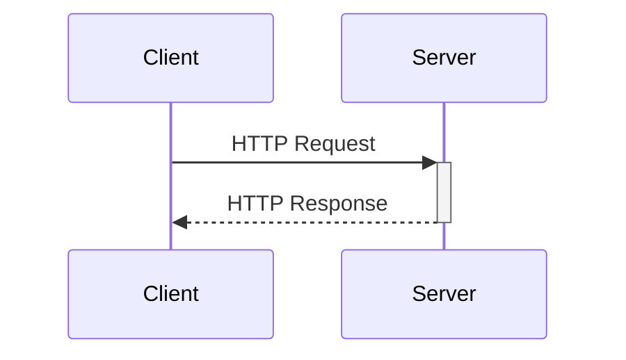
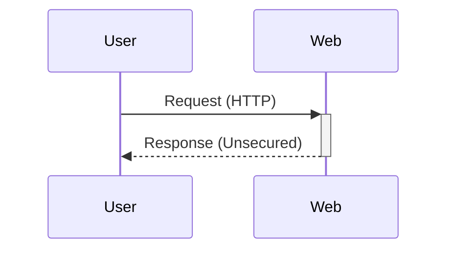
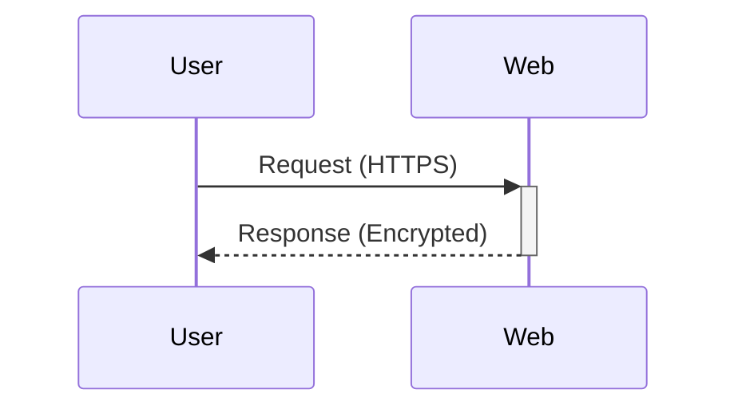

<PresenterTimer :minutes="0" :seconds="10" />

Data Pipelines

# HTTP APIs

Finally, something standard...

<!--
- Notes
-->

---
layout: two-cols-header
---

<PresenterTimer :minutes="1" :seconds="0" />

# Data Pipelines: HTTP APIs

Overview of HTTP, HTTPS, REST, and RPC APIs

::left::

- Introduce APIs in data communication
- HTTP vs. HTTPS: security in data transmission

::right::



<!--
>
Begin with a broad overview of APIs and explain the difference between HTTP and HTTPS protocols.
TODO review bullets for everything in this section...need more specifics
-->

---
layout: two-cols-header
---

<PresenterTimer :minutes="1" :seconds="0" />

# Understanding HTTP and HTTPS

Key protocols for web communication

::left::



::right::



<!--
>
Discuss the protocols HTTP and HTTPS, focusing on their roles in securing API data exchanges.
-->

---
layout: default
---

# Introduction to REST APIs

Exploring REST principles and usage

<PresenterTimer :minutes="1" :seconds="0" />

- What is a REST API?
  - Uses HTTP methods explicitly for operations
- Key principles:
  - Stateless operations
  - Resource-based interactions
- Examples: Zoom REST API

<!--
>
Explain REST API principles, emphasizing statelessness and resource-based interactions.
- CRUD operations
-->

---
layout: default
---

# Introduction to RPC APIs

Procedure call model over the internet

<PresenterTimer :minutes="1" :seconds="0" />

- What is RPC?
  - Remote procedure calling protocols and practices
- Differences from REST:
  - Action-based rather than resource-based
- Examples: Zabbix JSON-RPC

<!--
>
Define RPC and compare it with REST in terms of action orientation versus resource orientation.
-->

---
layout: default
---

# Working with API Responses

Handling responses from REST and RPC APIs

<PresenterTimer :minutes="1" :seconds="0" />

- Common response formats: JSON, XML
- Error handling and status codes in HTTP responses

<!--
>
Teach handling API responses, focusing on interpreting common data formats and managing errors.
-->

---
layout: default
---

# API Best Practices and Security

Enhancing API integration and data protection

<PresenterTimer :minutes="1" :seconds="0" />

- Best practices for using APIs
- Security considerations: Authentication, Encryption, Rate Limiting

<!--
>
Discuss best practices and security measures in API utilization, focusing on reliable and secure API interactions.
TODO be specific here...basic auth, bearer auth, oauth, etc / https / etc
-->

---
layout: default
---

# Introduction to [JSONpath](https://jsonpath.com/)

Query language for JSON

<PresenterTimer :minutes="1" :seconds="0" />

````md magic-move {at:1}
```json
$
```

```json
$.store
```

```json
$.store.book
```

```json
$.store.book[*]
```

```json
$.store.book[*].author
```
````

```json {1-16|3-14|4-13|4-13|5,10}{at:1}
{
  "store": {
    "book": [
      {
        "author": "J.K. Rowling",
        "title": "Harry Potter",
        "price": 9.99
      },
      {
        "author": "J.R.R. Tolkien",
        "title": "The Lord of the Rings",
        "price": 12.99
      }
    ]
  }
}
```

<div v-click="5">

```json
["J.K. Rowling", "J.R.R. Tolkien"]
```

</div>

<!--
- Introduce JSONpath, explain its syntax, and provide examples to query JSON data.
- TODO embed jsonpath test page or link out?
-->

---
layout: default
---

<PresenterTimer :minutes="20" :seconds="0" />

# Understanding JSONata

Advanced JSON data transformation

<div class="flex justify-center w-full">
    <Youtube class="w-5/6 h-425px" id="ZBaK40rtIBM" />
</div>

<!--
>
Present JSONata, highlighting its advanced capabilities for dynamic JSON data transformation.
TODO add code for example
-->

---
layout: default
---

<PresenterTimer :minutes="20" :seconds="0" />

# HTTP: Collecting in Node-RED

- Great first-class support of HTTP natively
- Also native JSONata support!

---

<PresenterTimer :minutes="20" :seconds="0" />

# HTTP: Collecting in Zabbix

- Zabbix has native support for HTTP
- Not as streamlined as Node-RED, but still very powerful
- Uses JSONpath for parsing rather than JSONata sadly

<!--
Show gets and traps
-->

---

<PresenterTimer :minutes="2" :seconds="0" />

# Key Takeaways

- HTTP APIs are the most common way to interact with modern systems
- REST and RPC are the two most common API paradigms
- JSONpath and JSONata are powerful tools for parsing JSON data
- Security is a critical consideration when working with APIs

---
layout: center
---

<PresenterTimer :minutes="2" :seconds="0" />

# Questions?
