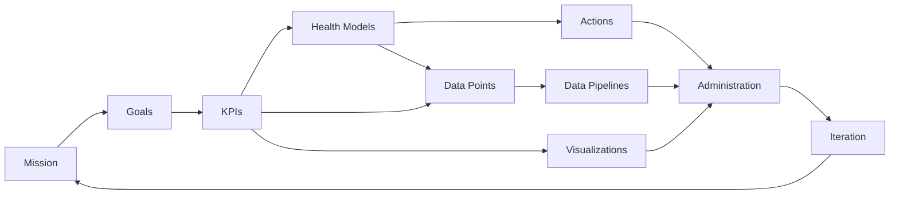

<PresenterTimer :minutes="0" :seconds="30" />

# Planning

The 7th core task of monitoring

---

<PresenterTimer :minutes="2" :seconds="0" />

# Knowledge Check

Raise your hand if you...

<v-clicks>

- Have implemented monitoring before?
- Have built a detailed project plan?
- Enjoy project management?
- Despise project management?

</v-clicks>

<!--
"Proper Planning and Preparation Prevents Piss Poor Performance" - British army adage called "The seven Ps"
I always heard it as "Proper Prior Planning Prevents Piss Poor Performance." Seven "Ps" without a messy "and"
-->

---
layout: two-cols-header
---

# The "Monitoring Plan"

Owned by one, contributed to by all

<PresenterTimer :minutes="3" :seconds="0" />

::left::

<v-clicks>

0.  Why
1.  Goals
2.  KPIs
3.  Health Models
4.  Data Points

</v-clicks>

::right::

<v-clicks>

5.  Data Pipelines
6.  Actions
7.  Visualizations
8.  Administration
9.  Iteration

</v-clicks>

<!--
- A monitoring plan is a roadmap for monitoring your AV system 
- AKA system monitoring plan
- It's a living document that evolves with the needs of the organization
- It's a way to align the technology with the business
- Serves 3 purposes
   - What are we monitoring (problem to solve)
   - How will we monitor it (health models, events, data pipelines)
   - What do we do with it once it's monitored (visualization, KPI / goal reporting, action plans)
- ONE PERSON should own the plan...usually a program manager / project manager / product manager. 
- EVERYONE should contribute to the plan
-->

---
layout: default
---

<PresenterTimer :minutes="1" :seconds="0" />

# Finding Why

Putting words to the reason we want to monitor in the first place

<v-clicks>

- Sometimes called a [mission]{.highlight} / [vision]{.highlight} / [purpose]{.highlight}, etc
- Answer the question of "[why]{.highlight}"
- Focuses on the [big picture]{.highlight}
- Aligns the team around a [unified purpose]{.highlight}
- Think of it like a [mega goal]{.highlight}
- Should be [clear]{.highlight} and [concise]{.highlight}
- All goals and KPIs should [tie back to this]{.highlight}

</v-clicks>

<!--
- You don't normally get to define why, you are often responding to it...it just helps if you have a super clear understanding of what it is and are aligned with others on that
- Foundation of everything we're going to do...you want to get this one right.
- Focus on pain points...what is the big picture problem that we're trying to solve?
- This is what you rally people around. 
- Why are we doing this? 
- What is the big picture problem that we're trying to solve?
- What is the big picture opportunity that we're trying to capture?
-->

---
layout: default
---

<PresenterTimer :minutes="1" :seconds="0" />

# Goals

The milestones towards accomplishing the mission

<v-clicks>

- Goals show us the path to [success]{.highlight} in our [mission]{.highlight}
- Contract between the [team]{.highlight} and the [business]{.highlight}
- Be [SMART]{.highlight}
  - Specific, Measurable, Achievable, Relevant, Time-bound
- One person should ultimately be [responsible]{.highlight} for each goal
- Keep it [simple]{.highlight}
- Establishing a [baseline]{.highlight} is a valid goal if you don't have one
- Don't forget about [operational]{.highlight} goals

</v-clicks>

<!--
- SMART stands for Specific, Measurable, Achievable, Relevant, Time-bound
- One owner per goal
- Creates accontability and focus
- Don't go right for "decrease x by y%"...start with "establish a baseline for KPI x and can be used as a service-level indicator in the future"
-->

---
layout: default
---

<PresenterTimer :minutes="1" :seconds="0" />

# KPIs

"Key Performance Indicators" are our finger on the pulse

<v-clicks>

- KPIs measure our [progress]{.highlight} towards our goals
- Built from underlying [metrics]{.highlight}
- Important to know what values are [good]{.highlight} and what values are [bad]{.highlight}
  - Thresholds, SLAs, Goals, etc ... driven by the business
- Codifies our methodology for [calculating]{.highlight} a KPI
  - Source data
  - Frequency
  - Units
- Clearly states [who is responsible]{.highlight} for delivering on this KPI

</v-clicks>

<!--
- Maybe do one or two brief examples.
- Don't get into HOW to collect the data yet, focus on the goals and the KPIs
- The M in SMART ...we know what we want to do, we know WHY we want to do it, but how do we know IF WE'RE ACTUALLY DOING IT?
- Again, generally one owner per KPI, as a given KPI usually maps to a given goal
-->

---
layout: default
---

<PresenterTimer :minutes="1" :seconds="0" />

# Health Models

Specific to uptime-related KPIs

<v-clicks depth=2>

- The formula that determines the [health of a system]{.highlight} from underlying data points
- The [methodology]{.highlight} used to feed the KPI for system [uptime]{.highlight} / availability / health
- Represented with traffic lights for [severity]{.highlight} (red, yellow, green)
- Built on top of data-driven [problem events]{.highlight} which are triggered from conditions in the underlying data
- [Unique]{.highlight} to each system template
- [Flexible]{.highlight} model that can be adapted to your needs

</v-clicks>

<!--
- Health modeling is a way to define what "healthy" and "unhealthy" look like for your system.
- Health could change from system TYPE to system TYPE...take a display locked to an input for example.
- KEY: There could be other states, but they must map to either healthy or not as the point of a health model is to determine UP or DOWN which impacts SLAs.
- Determine health states
- Determine factors that contribute to health
- Matrix of health states and factors
- Sometimes used interchangeably with the uptime KPI / SLI itself
Healthy (Ok), Degraded, Unhealthy (Down)
-->

---
layout: default
---

<PresenterTimer :minutes="1" :seconds="0" />

# Data Points

What data should we collect in the first place?

<v-clicks depth=2>

- At this stage, we decide which [data points]{.highlight} we need to collect
- Based on [goals]{.highlight}, [KPIs]{.highlight}, and [health models]{.highlight}
- Answers the questions
  - What [data point]{.highlight} do we need to collect? (unique key)
  - Which [type of data]{.highlight} is it?
  - [Where]{.highlight} will it likely come from?
  - [How often]{.highlight} should we collect it?
  - How long should we [keep]{.highlight} it?
- Lays the foundation for the [data pipeline]{.highlight} phase

</v-clicks>

---
layout: default
---

<PresenterTimer :minutes="1" :seconds="0" />

# Data Pipelines

The hard part

<v-clicks depth=2>

- End-to-end [data flow]{.highlight} from source to sink
- First, we acquire raw data during the [Input]{.highlight} stage
- Then we [Parse]{.highlight} it into something useful
- Next we [Filter]{.highlight} out the noise
- All the while we [Buffer]{.highlight} the data while processing it
- The data is tagged which instructs where the data should be [Routed]{.highlight}
- Finally, we [Output]{.highlight} the data to the target system
- Most monitoring platforms [abstract]{.highlight} this away

</v-clicks>

<!--
- Data pipelines are the lifeblood of monitoring. 
- They are the "how" to our "what" and "why" of monitoring.
- How the sasuage is made
- The hardest part of monitoring AV
- Data pipelines are the hardest part of monitoring AV
   - Input: Acquire! where does the data come from? Push or poll? What protocol does it use?
   - Parse: how to we interpret the data and turn it into something normalized, structured, and useful?
   - Filter: what data do we care about, and what data do we ignore? How do we filter out the noise?
   - Buffer: where do we hold the data while we're processing it or preparing to send it out? How do we prevent data loss when we lose network connectivity?
   - Route: where is a given datapoint supposed to go? How do we get it to the right place at the right time?
   - Output: what target system will consume the data? What format does it need to be in? How often do we send it? Is it polled?
-->

---
layout: default
---

<PresenterTimer :minutes="1" :seconds="0" />

# Actions

But what do we do about it

<v-clicks>

- Generally triggered by [Events]{.highlight}
- Sometimes [manual]{.highlight}
- [Notifications]{.highlight} are the most common
  - Type, recipient, frequency
- With maturity, we can trigger [Automations]{.highlight}
  - Scripts, incident management, validations, etc
- Can be [conditional and complex]{.highlight}, varies by platform

</v-clicks>

<!--
- Typically actions are triggered by events, though they can be triggered manually too
- Oftentimes it's a simple as a notification
   - They come in all shapes and sizes...messages via chat tools, emails, SMS, pagers, push notifications, etc.
   - Notifications can be customized to look the way they need to look (visualizations), and go to the people who need to see them (event owners)
- With maturity, we can use  automations
   - Scripts to perform certain actions automatically (restart a service, etc)
   - Incident management: create a ticket in a ticketing system
   - Waits, validations, etc
-->

---
layout: default
---

<PresenterTimer :minutes="1" :seconds="0" />

# Visualizations

The best way to bring data to life

<v-clicks depth=2>

- Aids [operations]{.highlight} and [decision-making]{.highlight}
- The so-called [single pane of glass]{.highlight}
- Know your [audience]{.highlight}
- Most well known are [Dashboards]{.highlight}
- For periodic or on-demand review, we have [Reports]{.highlight}
- Design [Notifications]{.highlight} to include relevant data and context
- [Built-in tools]{.highlight}, platform specific.

</v-clicks>

<!--
- We've got our data into our events, we have our triggers / alerts, now how are we gonna see all of this stuff? 
- The single pane of glass is the holy grail of monitoring
- All visualization is about audience...operational...administrators...executive
- Dashboards: for daily use, real-time, and operational...what do we need to know right now? Generally widget & canvas-based
- Reports: for on-demand and periodic review of SLAs, KPIs and goals...email a PDF, etc....Are we on track?
- Notifications: for immediate response to events, part of our event response planning (actions)
- Browser / explorers: built-in tools to explore the data, drill down, etc. Generally not editable...come with the platform.
-->

---
layout: default
---

<PresenterTimer :minutes="1" :seconds="0" />

# Administration

Reality check

<v-clicks>

- Who will [administer]{.highlight} the end-to-end system?
  - Data pipelines, notifications, scripts, visualizations, user access, etc
- Who else will be involved and what [resources]{.highlight} will they need?
  - Access, training, documentation, support, customization, visualizations, notification types, etc
- What [platform/s]{.highlight} are we using?
  - Can it handle our needs? Data pipelines, events, actions, visualizations, integrations, extensability etc
  - Does it fit our budget? At scale?
- What [data storage]{.highlight} considerations do we need to make?
  - Location, compliance, access, retention, backup, restore, archival, etc.

</v-clicks>

---
layout: default
---

<PresenterTimer :minutes="1" :seconds="0" />

# Iteration

There's no such thing as a perfect plan

<v-clicks>

- Review on a [regular basis]{.highlight}
- "Start, stop, continue" [retrospective]{.highlight} or similar
- [Evolve]{.highlight} with the needs of the organization / business
- Has the [mission]{.highlight} changed? The [goals]{.highlight}? The [KPIs]{.highlight}?
- How is our [performance]{.highlight}? Are we [meeting our goals]{.highlight}?
- Is our reporting plan [effective]{.highlight}?

</v-clicks>

<!--
- There's no such thing as done
- Business changes, technology changes, people change...so do plans 
- Review the plan regularly and EVOLVE
- "Start, stop, continue" retrospective or similar
- One person should own the plan, but everyone should contribute to it
-->

---

<PresenterTimer :minutes="2" :seconds="0" />

# Key Takeaways

- The [Monitoring Plan]{.highlight} is a [living]{.highlight} roadmap for monitoring your systems
- Owned by [one]{.highlight}, contributed to by [all]{.highlight}
- Core components:

<!--
- read the slide
-->

---
layout: center
---

<PresenterTimer :minutes="5" :seconds="0" />

# Questions?
