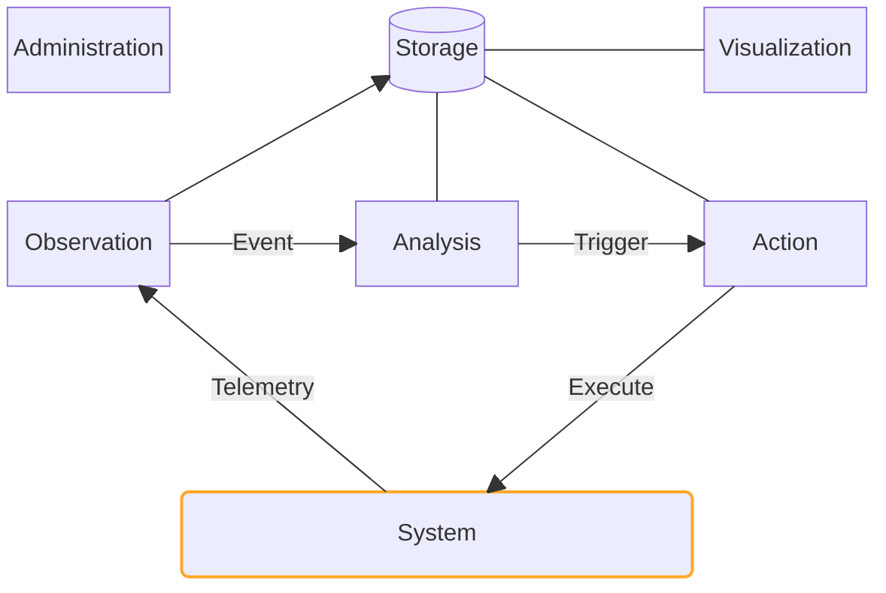

# Monitoring Primer

An introduction to the fundamentals of monitoring and its application in AV systems.

---
layout: center
---

<PresenterTimer :minutes="4" :seconds="0" />

# What is Monitoring?

How would you define it?

<!--
- Getting data?
- Getting alerts when something breaks? 
- Remotely supporting devices? 
- Dashboards?
-->

---
layout: default
---

<PresenterTimer :minutes="3" :seconds="0" />

# Defining Monitoring

### Splunk:

> Any processes and tools you use to determine if your organization’s IT equipment and digital services are working properly. Monitoring helps to detect and help resolve problems — all sorts of problems.[^1]

 

### Google:

> Collecting, processing, aggregating, and displaying real-time quantitative data about a system, such as query counts and types, error counts and types, processing times, and server lifetimes. [^2]

[^1]: [Splunk](https://www.splunk.com/en_us/resources/it-monitoring.html)
[^2]: [Google SRE Handbook](https://landing.google.com/sre/sre-book/chapters/monitoring-distributed-systems/)

---
layout: statement
---

<PresenterTimer :minutes="0" :seconds="10" />

## Fundamentally, monitoring is about 2 questions:

    
        What is happening...
    
    
    and why?
    

---
layout: default
---

<PresenterTimer :minutes="3" :seconds="0" />

# Telemetry | Monitoring | Observability

Extended terms and disambiguation

- **Telemetry** (_noun_):
  - The data we collect from our systems
- **Monitor** (_verb_):
  - The act of processing realtime telemetry data for some business purpose.
- **Observability** (_noun_):
  - The ability to understand the state of a system based on its telemetry data.
  - A mindset that empowers teams to answer any question through the collection and analysis of data.[^1]
    [^1]: [Source - Splunk](https://www.splunk.com/en_us/blog/devops/observability-it-s-not-what-you-think.html)

<!--
Telemetry:
- Logs, metrics, and traces are all forms of telemetry data.
- It is the supporting pillar of observability and monitoring.
- The "WHAT"

Monitoring:
- Processing telemetry data to detect anomalies or predefined conditions.
- It's the "doing" part. The "HOW". 

Observability:
- A quality of your system that describes how well you understand its state from the outside. (ie "How well can we observe this?")
- The more complete the telemetry is, the more effective the monitoring is, the more "observable" the system is.
- Observability is the goal, telemetry and monitoring are the means.
- More a mindset than a toolset, empowering teams to answer any question through the collection and analysis of data
- The "WHY"
-->

---
layout: statement
---

<PresenterTimer :minutes="0" :seconds="10" />

## We [monitor]{.highlight} system [telemetry]{.highlight} to improve system [observability]{.highlight}.

---
layout: two-cols-header
---

<PresenterTimer :minutes="5" :seconds="0" />

# 6 Core Functions of a Monitoring System

 

::left::

- **Observation**: Collect, detect
- **Analysis**: Correlate, calculate, filter
- **Action**: Notify, respond
- **Storage**: Retain, serve
- **Visualization**: Dashboard, report, browse
- **Administration**: Configure, maintain, secure

::right::

 

\* [Inspired by](https://www.researchgate.net/figure/A-monitoring-system-has-four-main-components-observation-analysis-action-and-storage_fig1_279184218)

<!--
A monitoring system has 6 main components: observation, analysis, action, storage, visualization, and administration. An observation point represents technical means to recognize a system's state and state changes. The observation component acquires data and generates events. The analysis component processes events and triggers the action component if necessary. The action component can then enforce actions or report events. The storage component stores events and data. The visualization component provides a user interface to monitor the system. The administration component configures and maintains the monitoring system and overlaps with all functions
-->

---
layout: two-cols-header
class:
---

<PresenterTimer :minutes="3" :seconds="0" />

# Flavors of Monitoring

There are many types of monitoring, each focused on specific aspects of technology and performance.

::left::

- [Availability monitoring]{v-mark.box.orange="'+1'"} (network, server, cloud, infrastructure, etc.)
- Application performance monitoring (APM)
- Data / database monitoring

::right::

- Business activity monitoring
- Real-user monitoring (RUM) and synthetic monitoring
- Security monitoring

...and more

<!--
- Availability monitoring covers networks, servers, infrastructure, and other components to ensure they are up and running.

> That's enough definition for now, let's move on to why we monitor.
-->

---
layout: center
---

<PresenterTimer :minutes="4" :seconds="0" />

# Why do you want to monitor?

How would it make your life better? What problems would it solve for you?

<!--
- Focus on what problems we're solving...push them to be specific.
-->

---
layout: default
---

<PresenterTimer :minutes="3" :seconds="0" />

# Benefits of Monitoring

<v-clicks>

- **Early detection**: Identify issues before they become critical.
- **Proactive problem-solving**: Remedy issues before they impact users.
- **Performance optimization**: Understand system behavior and improve performance.
- **Resource allocation**: Optimize resource allocation and utilization.
- **Compliance and security**: Ensure compliance with regulations and security standards.
- **User experience**: Improve user experience and satisfaction.
- **Cost savings**: Reduce downtime and maintenance costs.

</v-clicks>

<!--
- And probably 100 other things
-->

---
layout: center
---

<PresenterTimer :minutes="0" :seconds="30" />

## The question isn't "[why should I monitor]{.highlight}"...

 

<v-click>

## ...but rather "[why am I not monitoring already]{.highlight}?"

</v-click>

<!--
-
-->

---
layout: center
---

<PresenterTimer :minutes="4" :seconds="0" />

# Why aren't you monitoring?

What obstacles are standing in your way?

<!--
- Complexity? 
- Cost?
- Lack of knowledge?
- Lack of tools?
- Lack of time?
- Lack of interest?
-->

---
layout: two-cols-header
---

<PresenterTimer :minutes="4" :seconds="0" />

# Monitoring AV Sucks

Yeah I said it...

 

::left::

<v-clicks>

- Hardware-focused
- Proprietary
- Agentless
- No API/communication standards
- System complexity

</v-clicks>

::right::

<v-clicks>

- Limited community
- Documentation
- Limited commerical pressure
- Competing interests

</v-clicks>

<v-click>

 

...and it's [not getting easier]{.highlight} anytime soon.

</v-click>

---
layout: image
image: /loz-dangerous-mod.png
class: border-20 border-black
title: "Dangerous"
---

<!--
- But you're in the right place!
- Monitoring AV is hard, but it isn't impossible.
- So, let's figure out how to set ourselves up for success.
-->

---
layout: default
---

<PresenterTimer :minutes="3" :seconds="0" />

# Tips for success

<v-clicks>
  
- Be in this class!
- Find peers and share openly
- Spec on standards and APIs
- Be noisy with vendors
- Study IT monitoring
- Go open-source
- _Have a plan!_

</v-clicks>

<!--
- Because anything worth doing is worth doing well.
-->

---
layout: default
---

<PresenterTimer :minutes="4" :seconds="0" />

# Key Takeaways

- Monitoring is about understanding [what]{v-click .reveal} is happening and [why.]{v-click .reveal}
- Telemetry is the [what,]{v-click .reveal} monitoring is the [how,]{v-click .reveal} and observability is the [why.]{v-click .reveal}
- The 6 core tasks of monitoring are `observation`, `analysis`, `action`, `storage`, `visualization`, and `administration`.
- Monitoring provides many benefits, including [early detection, proactive problem-solving, performance optimization, risk reduction, and cost savings.]{v-click .reveal}
- Monitoring AV systems is challenging due to [hardware focus, proprietary systems, and lack of standards.]{v-click .reveal}
- To succeed in monitoring, focus on resources like [community, education, standards, and planning.]{v-click .reveal}

---
layout: center
---

<PresenterTimer :minutes="5" :seconds="0" />

# Questions?
