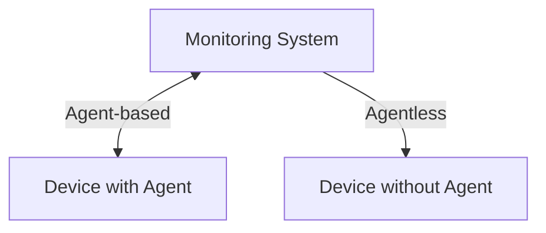

<PresenterTimer :minutes="4" :seconds="0" />

# Monitoring AV is hard

<!--
- Section break
- Way harder than it has any right to be
- That's going to be our next topic for the day
-->

---
layout: center
---

<PresenterTimer :minutes="3" :seconds="0" />

## Why is it so [hard]{.highlight} to monitor AV systems?

<!--
**INTERACTIVE**: Ask the room for their thoughts before revealing the answers
-->

---

<PresenterTimer :minutes="1" :seconds="0" />

# Why is monitoring AV hard?

Monitoring AV is hard

<v-clicks>

- Hardware & firmware means agentless
- Limited API standards or documentation
- Integrated systems have complex health models
- Insufficient commercial pressure
- Conflicts of interest

</v-clicks>

<!--
- DON'T DIG INTO THESE...COVERING EACH IN DEAIL IN THE NEXT SLIDES
- [click] Hardware means agentless monitoring, which has its own set of challenges.
- [click] limited to no API standards, docs, etc
- [click] Complex systems make for complex health models
- [click] Insufficient commercial pressure
- [click] Conflicts of interest
- Let's dive into each one of these a bit more [click]
-->

---
layout: two-cols-header
---

<PresenterTimer :minutes="2" :seconds="0" />

# Hardware & firmware means agentless

Monitoring AV is hard

::left::
<v-clicks>

- Typically monitoring is agent-based
    - Fetch locally & push
- Firmware-based hardware appliances can't run agents
- Can only monitor what the device provides
    - Sometimes push, usually poll
- Increases complexity and integration requirements
    - A new integration per device model / API
    - Sheer volume of unique AV products

</v-clicks>

::right::

<!--
[click] [click] [click] [click]
- Agentless monitoring means we have to come in from the outside and ask the device questions
-->

---

<PresenterTimer :minutes="2" :seconds="0" />

# Limited API standards or documentation

Monitoring AV is hard

<v-clicks>

- While control APIs tend to be pretty good, management APIs are not
- No consistency in port, protocol, or data format
- Wildly varying levels of completeness
- No standardization across manufacturers, products, or even FW version
- On top of that, poor documentation

</v-clicks>

<!--
- Completeness: display that tells us what input its on may not tell us what temperature it currently is, or what its CPU / memory utilization is, or if it's dropping packets on the interface
- SNMP is a good example...even if we do have it, we likely don't have a MIB, nor does that SNMP cover the required telemetry on the device
-->

---

<PresenterTimer :minutes="2" :seconds="0" />

# Integrated systems have complex health models

Monitoring AV is hard

<v-clicks>

- Measuring system health is the #1 most important thing in monitoring
- Health models codify the impact of potential failures in a system (🔴🟡🟢)
- AV systems are complex with many component interactions
    - More complexity, more potential failure points
- Each unique combination of gear requires a new health model
    - Large volume of bespoke systems makes this unsustainable
- Standards required for health modeling, otherwise unfeasible

</v-clicks>

---

<PresenterTimer :minutes="1" :seconds="0" />

# Insufficient commercial pressure

Monitoring AV is hard

<v-clicks>

- Manufacturers hold a lot of the cards here
- Insufficient commercial pressure to provide open, documented, stable APIs
- Not enough customers are demanding it / voting with their wallets

</v-clicks>

---

<PresenterTimer :minutes="1" :seconds="0" />

# Conflicts of interest

Monitoring AV is hard

<v-clicks>

- Many manufacturers want to sell you their own management tools
- Providing open monitoring APIs would compete with that
- Often not incentivized to make it easier for you to monitor your systems if it means you won't buy their tools

</v-clicks>

<!--
- SOME manufacturers, not all
- There are good guys out there too and I'm happy to point you in the right direction
-->

---
layout: center
---

## There's a lot of that we [can't control]{.highlight}...
 

<v-click>

## But there are some things we [can]{.highlight}!

</v-click>

---

<PresenterTimer :minutes="1" :seconds="0" />

# So what can we do?

Monitoring AV is hard

<v-clicks>

- Spec observable products and design observable systems
    - Subset of building systems that are manageable at scale
- Choose monitoring platforms that are flexible and support our needs
- Have a plan, start small, and iterate

</v-clicks>

<!--
- [click] [click] [click]
- These 3 things are what we'll spend the rest of this class on
-->
