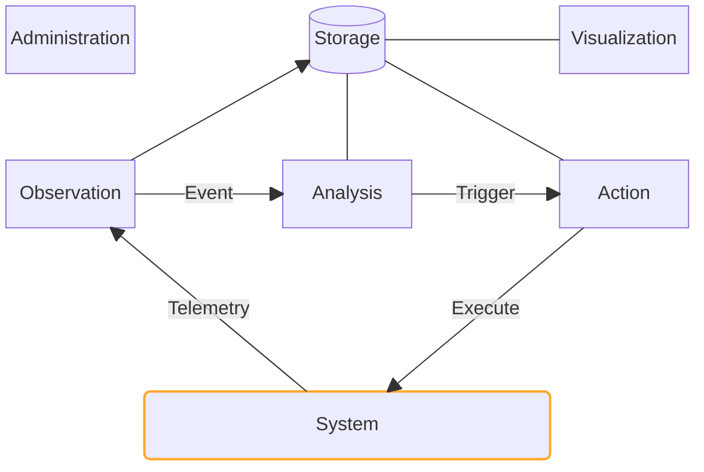
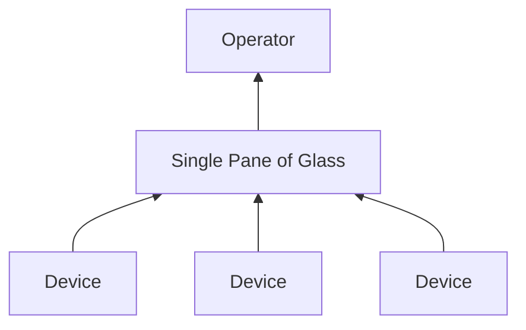
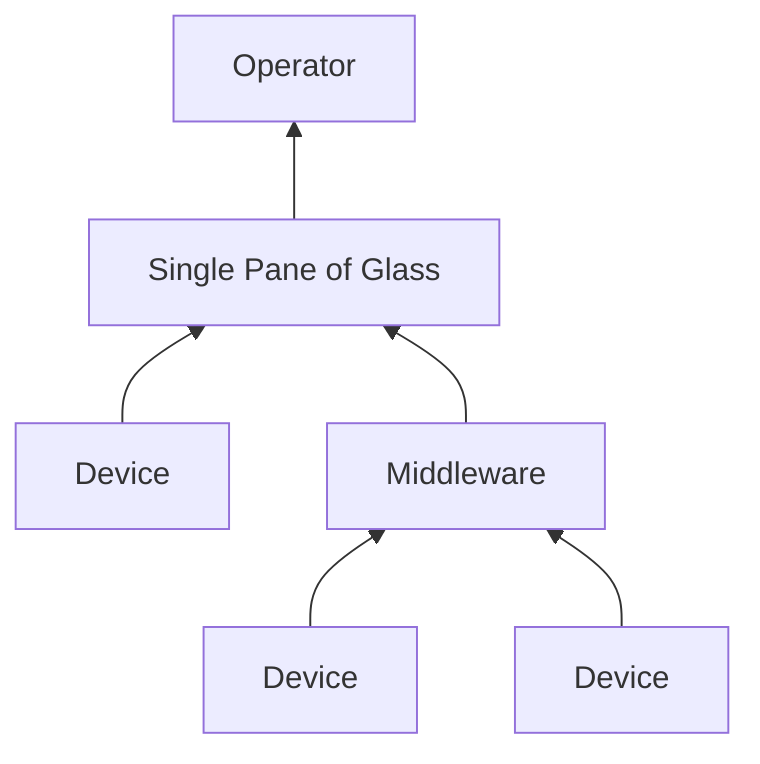
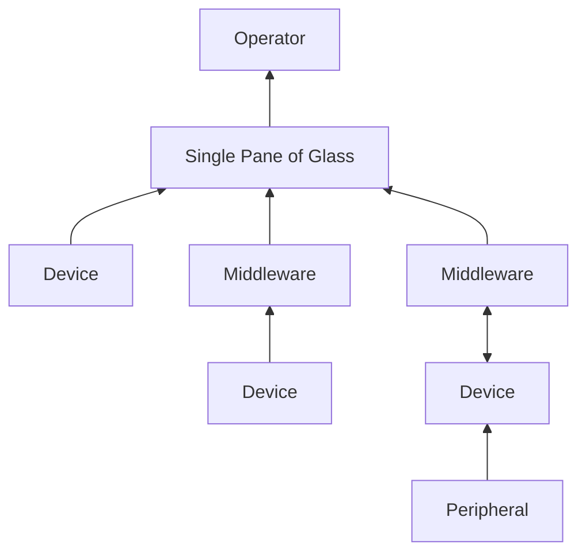

layout: center
---

<PresenterTimer :minutes="1" :seconds="0" />

## What is a [monitoring platform]{.highlight}?

<!--
**INTERACTIVE**
-->

---
layout: default
---

<PresenterTimer :minutes="1" :seconds="0" />

# Definition

Monitoring platforms

<v-clicks>

- A [monitoring]{.highlight} platform is a software system that 
- collects, processes, and displays [telemetry]{.highlight} data from systems
- in order to help [operators]{.highlight} understand the state of the system,
- detect and resolve issues before they become problems,
- and optimize system performance.

</v-clicks>

<!--
-->

---
layout: default
---

<PresenterTimer :minutes="1" :seconds="0" />

# Reminder: 4 key terms

Monitoring platforms

- **Telemetry** (_noun_):
  - The data we collect from our systems.
- **Monitor** (_verb_):
  - The act of collecting & processing realtime telemetry (data) for some business purpose.
- **Observable** (_adjective_):
  - The degree to which we can understand the state of a system by monitoring its telemetry.
- **Operator** (_noun_):
  - The person who is responsible for monitoring & managing the system.
- The more complete the [telemetry]{.highlight} is and the more effective the [monitoring]{.highlight} is, the more [observable]{.highlight} the system is, and the better prepared the [operator]{.highlight} is.

<!--
- while we're at it, let's introduce a few additional terms [click]
-->

---
layout: two-cols-header
---

<PresenterTimer :minutes="1" :seconds="0" />

# Types of Monitoring Platforms

Monitoring platforms

::left::

<v-clicks>

- **[Generic (infra, network, availability)]{v-mark="{ at: 6, color: 'orange', type: 'box'}"}**
  - Flexible, general purpose, customizable
  - Sometimes open source, sometimes commercial
- **Cloud Device Management Platform** (CDMP)
  - Native integration, OEM-specific
  - Useful as middleware but not for a single pane
- **AV Monitoring**
  - Typically built on top of control systems
  - Proprietary, vendor integration-based

</v-clicks>

::right::

<v-clicks>

- **Application Performance Monitoring** (APM)
  - Focuses on appllication development and performance
  - Often requires data to be pushed to the monitoring platform
- **Security Monitoring** (SIEM, IDS, etc.)
  - Focuses on security threats and incidents

</v-clicks>

<!--
- There are many types of monitoring platforms, but let's dig into a few of them
- [click] Generic monitoring platforms are flexible, general purpose, and customizable. They can be open source or commercial. They are often used for infrastructure, network, and availability monitoring
- [click] Cloud Device Management Platforms (CDMPs) are native to the cloud and are often OEM-specific. They are useful as middleware but not for a single pane of glass
- [click] AV monitoring platforms are typically built on top of control systems. They are proprietary and are often based on vendor integration
- [click] Application Performance Monitoring (APM) platforms focus on application development and performance. They often require data to be pushed to the monitoring platform
- [click] Security monitoring platforms focus on security threats and incidents
- For the sake of this class, we'll focus on [click] generic monitoring platforms and I'll help you understand why I think they make the best choice most of the time

-->

---
layout: two-cols-header
---

<PresenterTimer :minutes="3" :seconds="0" />

# 6 Core Functions of a Monitoring System

Monitoring platforms

 

::left::

<v-clicks>

- **Observation**: Collect, detect
- **Analysis**: Correlate, calculate, filter
- **Action**: Notify, respond
- **Storage**: Retain, serve
- **Visualization**: Dashboard, report, browse
- **Administration**: Configure, maintain, secure

</v-clicks>

::right::

 

\* [Inspired by](https://www.researchgate.net/figure/A-monitoring-system-has-four-main-components-observation-analysis-action-and-storage_fig1_279184218)

<!--
- First, let's talk about the 6 core functions of a monitoring system
A monitoring system has 6 main components: observation, analysis, action, storage, visualization, and administration.
- [click] An observation point represents technical means to recognize a system's state and state changes. The observation component acquires data and generates events. This is the hard part in AV...once you get the data in, most AV systems behave like any other IT system. So we'll put a lot of emphasis on the telemetry collection / extraction process
- [click] The analysis component processes events and triggers the action component if necessary. 
- [click] The action component can then enforce actions or report events.
- [click] The storage component stores events and data. 
- [click] The visualization component provides a user interface to monitor the system. 
- [click] The administration component configures and maintains the monitoring system and overlaps with all functions
- It's important to note that these functions are not necessarily separate components in a monitoring system, but rather functions that a monitoring system must perform. Missing even one of these functions can make a monitoring system ineffective. Each monitoring platform has varying strengths and weaknesses in each of these areas, so it's important to understand what you need from a monitoring platform before selecting one.
-->

<!-- ---

<PresenterTimer :minutes="3" :seconds="0" />

# Key areas of concern for AV

Monitoring platforms

<v-clicks>

- **Telemetry collection**: flexible, extensible, agentless
- **Scalability**: templates, distributed monitoring
- **Customization**: open APIs, plugin architecture
- **Remote access**: tunneling, security
- **Security**: granular user permissions, SSO, MFA
- **Pricing**: per device, per room, per user, per metric, per feature, per data consumption
- **

</v-clicks> -->

---
layout: two-cols-header
---

<PresenterTimer :minutes="1" :seconds="0" />

# Key areas of concern for a monitoring platform

Monitoring platforms

::left::

1. Agentless monitoring
2. Single pane of glass
3. Flexible data collection
4. Scalability
5. Customizable / extensible
6. Remote access
7. Tunable alerts & actions
8. Granular user permissions

::right::

9. Pricing that works for AV
10. Advanced visualizations
11. Service monitoring with health models
12. Community support
13. Commercial support
14. Extensive documentation
15. Well established release cycle

---

# Agentless monitoring

Monitoring platforms - Key areas of concern

<PresenterTimer :minutes="2" :seconds="0" />

<v-clicks>

- Not Mac, Windows, Linux, etc - No agents
- Leverages collectors to pull data from devices
- Flexible collector hosting (Bare metal, Virtual machine, Container)
- Buffers data when internet drops
- Collector high-availability
- Extensible with custom scripts, binaries, etc.

</v-clicks>

---

<PresenterTimer :minutes="2" :seconds="0" />

# Single pane of glass

Monitoring platforms - Key areas of concern

<v-clicks>

- All devices, systems, services in one place
- Centralized processing of data and alerts
- Manage dependencies between devices & services
- Single database of all assets
- One place to configure alerts, actions, etc.
- Single pane does not necessarily mean single tool

</v-clicks>

---

<PresenterTimer :minutes="2" :seconds="0" />

# Single Pane of Glass != Single Tool

Monitoring platforms - Key areas of concern

<v-clicks>

</v-clicks>

<!--
- [click] All devices direct to platform
- [click] Some devices direct to platform, some to tool
- [click] Some devices direct to platform, some to tool, some to middleware
-->

---

<PresenterTimer :minutes="2" :seconds="0" />

# Flexible data collection

Monitoring platforms - Key areas of concern

<v-clicks>

- Due to variability in device APIs, maximum flexibility is required
- Protocol support should include:
  - ICMP, SNMP, UDP & TCP simple checks, Console checks (SSH, Telnet, Raw TCP), HTTP/s, Web Driving, and more
  - Custom script + arbitrary binary
- Push metrics from devices to platform
  - Middleware, control systems, etc.
- Flexible parsing & filtering capabilities
  - Regular expressions, JSONPath, XPath, etc.
- Dynamic creation of metrics and devices from scripts, queries, scans

</v-clicks>

---

<PresenterTimer :minutes="2" :seconds="0" />

# Scalability

Monitoring platforms - Key areas of concern
<v-clicks>

- Device proliferation is a significant issue
- Scalability is a key concern
- Must have templates with inheritance
  - Metrics, triggers, graphs, dashboards, discovery rules, etc.
  - Configure in one place, apply to thousands of devices
- API-driven configuration when required
- Distributed monitoring capabilities
- Cloud-native or cloud-ready via containers

</v-clicks>

---

<PresenterTimer :minutes="2" :seconds="0" />

# Customizable / extensible

Monitoring platforms - Key areas of concern

<v-clicks>

- Open source vs. commercial
- Open APIs
- Plugin architecture
  - SNMP MIBs, custom scripts, etc.
  - Dashboard widgets
  - Custom pages
- Community contributions 

</v-clicks>

---
layout: two-cols-header
---

<PresenterTimer :minutes="2" :seconds="0" />

# Remote access

Monitoring platforms - Key areas of concern

::left::

<v-clicks>

- Remote access to devices & services
- Tunneling & proxying vs direct
- Security 
- Interfaces
  - Web pages
  - SSH, Telnet, Raw TCP
  - VNC, RDP

</v-clicks>

::right::

<v-clicks>

- Port forwarding
  - Proxy to host
  - Limited time & latching
- VPN
  - On-demand & inside-out
  - Supports desktop tools

</v-clicks>

<!--
Hammer home the importance of remote access for integrators...that it may be the most important thing, less-so for end users
-->

---
layout: two-cols-header
---

<PresenterTimer :minutes="2" :seconds="0" />

# Tunable alerts & actions

Monitoring platforms - Key areas of concern

::left::

<v-clicks depth=2>

- Alerts
  - Alert fatigue is real
  - Coorelation with similar alerts, parent, child, sibling
  - Acknowledgement by ops staff
  - Suppression when needed
  - Escalation policies including scripted actions
- Notifications via
  - Email, chat, SMS
  - Webhook
  - 3rd party integrations

</v-clicks>

::right::

<v-clicks depth=2>

- Actions
  - Run scripts on demand and on event
  - Arbitrary binaries for max flexibility
  - Restart services, reboot devices, etc
  - Set / get configurations
  - Perform local server management
- Alert + Action = Automation / [Self-Healing]{.highlight}

</v-clicks>

---

<PresenterTimer :minutes="2" :seconds="0" />

# Granular user permissions

Monitoring platforms - Key areas of concern

<v-clicks>

- Strong admin controls
- Role-based access control with flexible scoping
- Full CRUD controls for all objects
- Management of users by group
- Built-in and custom roles
- Permissions for devices, groups, templates, etc.
- Audit logs
- SSO, MFA, SCIM

</v-clicks>

---

<PresenterTimer :minutes="2" :seconds="0" />

# Pricing that works for AV

Monitoring platforms - Key areas of concern

<v-clicks>

- Depends on how you will fund it
- Open source vs. commercial
- Per device, per room, per user, per metric, per feature, per data consumption
- Edge component pricing
- Add-ons for advanced features
- Support costs
- 3rd party development needs

</v-clicks>

---
layout: two-cols-header
---

<PresenterTimer :minutes="2" :seconds="0" />

# Advanced visualizations

Monitoring platforms - Key areas of concern

::left::

<v-clicks>

- Dashboards
  - Widget & canvas
  - Line, bar, pie, gauge, map, etc.
  - Dynamic or static
  - Drill-down
  - BYO widgets
- Maps
  - Device, network, service
  - Customizable

</v-clicks>

::right::

<v-clicks>

- Reports
  - Customizable
  - Scheduled
- Custom pages
  - AV-specific views
  - Control system / CDMP integration

</v-clicks>

---

<PresenterTimer :minutes="2" :seconds="0" />

# Service monitoring with health models

Monitoring platforms - Key areas of concern

<v-clicks>

- Each system is a service
- Define health model for each & control bubble-up of issues
- Service level agreement monitoring & reporting
- Flexible service trees (service heirarchy)
- Service actions for automated responses

</v-clicks>

---

<PresenterTimer :minutes="2" :seconds="0" />

# Community support

Monitoring platforms - Key areas of concern

<v-clicks>

- Active community
- Forums, chat, etc.
- "Google-ability" of issues
- Shared library of scripts, templates, etc.
- Easier to hire for than niche tools

</v-clicks>

---

<PresenterTimer :minutes="2" :seconds="0" />

# Commercial support

Monitoring platforms - Key areas of concern

<v-clicks>

- Paid support for when things go wrong
- Many open source companies make money from enterprise support
- Provided direct or through partners
- SLAs (response time & resolution time)
- Professional services to help get started

</v-clicks>

---

<PresenterTimer :minutes="2" :seconds="0" />

# Extensive documentation

Monitoring platforms - Key areas of concern

<v-clicks>

- Critical for any serious monitoring platform
- Google "$vendor docs" before you buy
- Solid documentation is worth hundreds of hours
- Must be up-to-date and searchable
- Should include examples and use cases

</v-clicks>

---

<PresenterTimer :minutes="2" :seconds="0" />

# Well established release cycle

Monitoring platforms - Key areas of concern

<v-clicks>

- Regular updates on a fixed cycle
- Clear release notes with changelog
- Published roadmap for future features
- Ability to submit feature requests

</v-clicks>

---
layout: two-cols-header
---

<PresenterTimer :minutes="2" :seconds="0" />

# Recap: Key areas of concern for a monitoring platform

Monitoring platforms

::left::

1. Agentless monitoring
2. Single pane of glass
3. Flexible data collection
4. Scalability
5. Customizable / extensible
6. Remote access
7. Tunable alerts & actions
8. Granular user permissions

::right::

9. Pricing that works for AV
10. Advanced visualizations
11. Service monitoring with health models
12. Community support
13. Commercial support
14. Extensive documentation
15. Well established release cycle